# Salifort Motors - Providing data-driven suggestions for HR

## Business scenario and Problem Statement
The HR department at Salifort Motors wants to take some initiatives to improve employee satisfaction levels at the company. They collected data from employees, but now they don’t know what to do with it. They refer to you as a data analytics professional and ask you to provide data-driven suggestions based on your understanding of the data. They have the following question: **what’s likely to make the employee leave the company?**

Our goals in this project are to analyze the data collected by the HR department and to build a model that predicts whether or not an employee will leave the company.

If we can predict employees likely to quit, it might be possible to identify factors that contribute to their leaving. Because it is time-consuming and expensive to find, interview, and hire new employees, increasing employee retention will be beneficial to the company.

## Key Stakeholders
- Salifort’s Senior Leadership
- Human Resources (HR) department

## Deliverables
- An Excecutive Summary with insights and recommendations
- A model that predicts whether or not an employee will leave the company
- A jupyter notebook with code

## Understand the HR dataset 

In this [dataset](https://www.kaggle.com/datasets/mfaisalqureshi/hr-analytics-and-job-prediction?select=HR_comma_sep.csv), there are 14,999 rows, 10 columns, and these variables: 

Variable  |Description |
-----|-----| 
satisfaction_level|Employee-reported job satisfaction level [0&ndash;1]|
last_evaluation|Score of employee's last performance review [0&ndash;1]|
number_project|Number of projects employee contributes to|
average_monthly_hours|Average number of hours employee worked per month|
time_spend_company|How long the employee has been with the company (years)
Work_accident|Whether or not the employee experienced an accident while at work
left|Whether or not the employee left the company
promotion_last_5years|Whether or not the employee was promoted in the last 5 years
Department|The employee's department
salary|The employee's salary (U.S. dollars)

---

## Exploratory Data Analysis

### Steps taken
1. Loaded the required python packages and the dataset.
2. Had a general sense of the data using head() function.
3. Gathered basic information about data using info() function.
4. Performed descriptive statistics on the data using describe()
5. Performed data cleaning by renaming columns, checking null and duplicate values and outliers. Removed the duplicates and saved the data in a new dataframe.
6. Created Correlation matrix and Heatmap to find relations between the variables.
7. Created visualizations like boxplot, histogram, scatterplot, bar charts to get detailed view of the dataset.
8. Made observations from the charts on correlations between different variables.

### Summary of EDA

1. The dataset doesn't contain any missing values but has 3008 duplicate rows. That is 20% of the data. We've removed those and created a new dataset.

2. The boxplot shows that there are outliers in the `tenure` variable. Calculated interquartile range and found that there are 824 rows in the data containing outliers in `tenure` column.

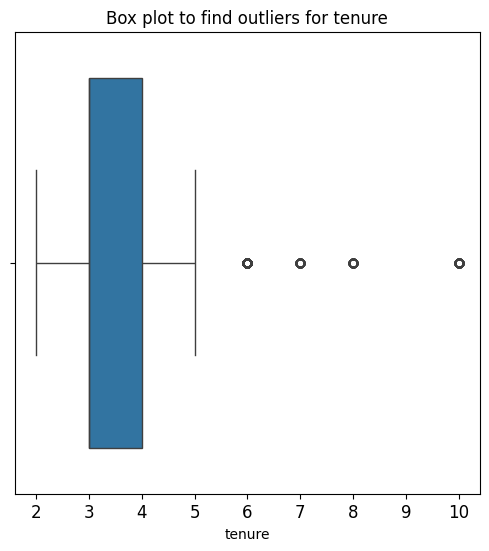

---

3. Created boxplot showing `average_monthly_hours` distributions for `number_project`. Created histogram showing distribution of `number_project`, comparing employees who stayed versus those who left.

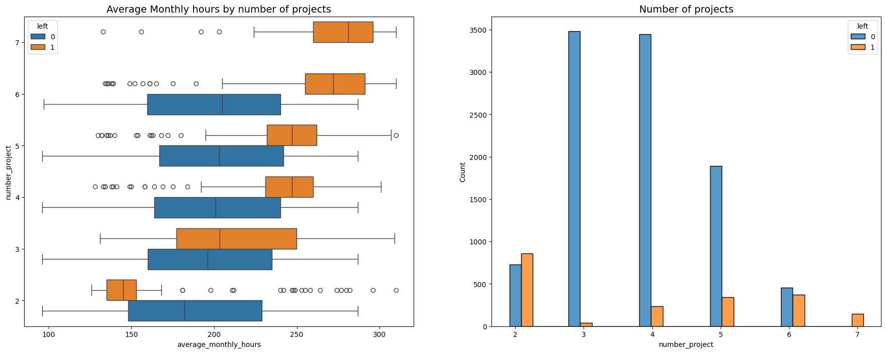

#### Observations:

It might be natural that people who work on more projects would also work longer hours. This appears to be the case here, with the mean hours of each group (stayed and left) increasing with number of projects worked. However, a few things stand out from this plot.

- There are two groups of employees who left the company: (A) those who worked considerably less than their peers with the same number of projects, and (B) those who worked much more. Of those in group A, it's possible that they were fired. It's also possible that this group includes employees who had already given their notice and were assigned fewer hours because they were already on their way out the door (see the box plot at 2 projects). For those in group B, it's reasonable to infer that they probably quit. The folks in group B likely contributed a lot to the projects they worked in, they might have been the largest contributors to their projects.

- Everyone with seven projects left the company, and the interquartile ranges of this group and those who left with six projects was ~255–295 hours/month, which is much more than any other group.

- The optimal number of projects for employees to work on seems to be 3–4. The ratio of left/stayed is very small for these cohorts. (look at histogram at 3 and 4 projects)

- If we assume a work week of 40 hours and two weeks of vacation per year, then the average number of working hours per month of employees working Monday–Friday `= 50 weeks * 40 hours per week / 12 months = 166.67 hours per month`. This means that, aside from the employees who worked on two projects, every group—even those who didn't leave the company—worked considerably more hours than this. It seems that employees here are overworked.

- From the histogram plot, we can see that everyone with 7 projects left the company.

---

4. We examined the average monthly hours vs. the satisfaction levels by plotting a scatter plot.

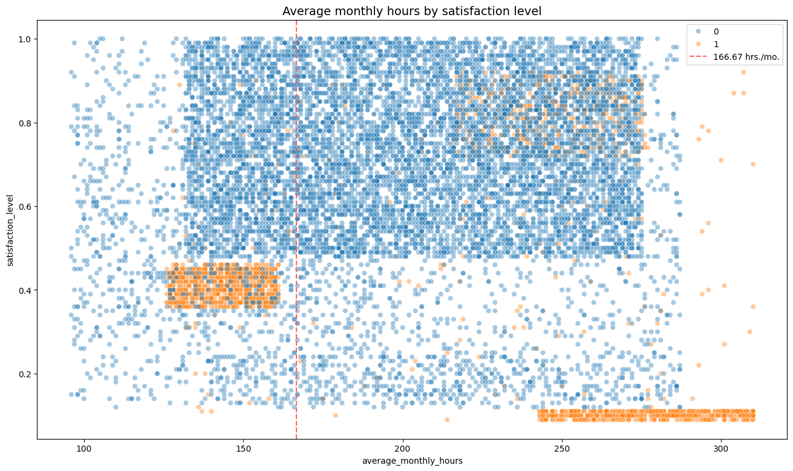

#### Observations:

- From the above scatter plot, we can observe that there are 3 groups of employees who left.
- Group 1: employees who had worked 240-320 hours/month. 320 hrs per month ~ 80 hrs per week, which is double the normal work hours. Due to heavy work load, the satisfaction level is very low (close to 0).
- Group 2: employees who had worked normal working hours. Still, the satisfaction level is only around 0. It is not clear why they have left. It's possible they felt pressured to work more, considering so many of their peers worked more. And that pressure could have lowered their satisfaction levels.
- Group 3: employees who had worked 210-280 hours/month, which is 280 hrs per month, has higher satisfaction levels ranging 0.7 - 0.9. Since the satisfaction levels are high, we can assume that work load is not the reason for leaving, it's difficult to speculate why they might have left.

- Note the strange shape of the distributions here. This is indicative of data manipulation or synthetic data.

---

5. Examined the relationship between tenure and satisfaction levels.

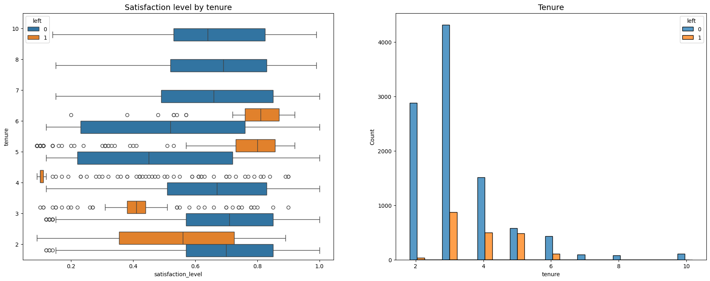

#### Observations:

- Employees who left fall into two categories: dissatisfied employees with shorter tenures and very satisfied employees with medium-length tenures.
- Four-year employees who left seem to have an unusually low satisfaction level. It's worth investigating changes to company policy that might have affected people specifically at the four-year mark, if possible. 
- The longest-tenured employees didn't leave. Their satisfaction levels aligned with those of newer employees who stayed. 
- The histogram shows that there are relatively few longer-tenured employees. It's possible that they're the higher-ranking, higher-paid employees.
- From the histogram, we can observe that most employees who left have tenure ranging from 3-5 years.

---

6. We can observe that the mean and median satisfaction level is lower for employees who left than those employees who stayed, as expected. Interestingly, among employees who stayed, the mean satisfaction score appears to be slightly below the median score.

---

7. Examined the salary levels for different tenures. The plots below show that long-tenured employees were not disproportionately comprised of higher-paid employees.

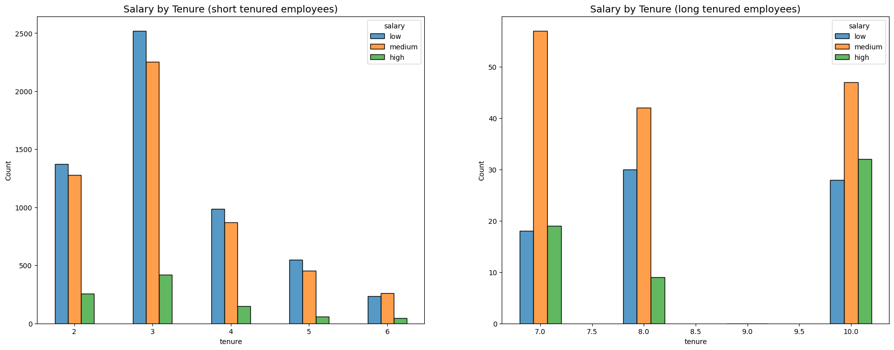

---

8. Explored the correlation between working long hours and receiving high evaluation scores.

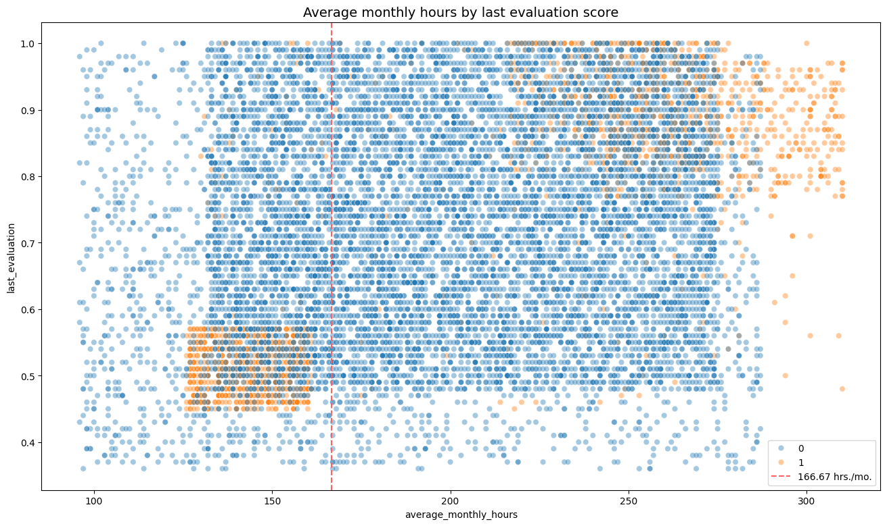

#### Observations:

- The scatterplot indicates two groups of employees who left: overworked employees who performed very well and employees who worked slightly under the nominal monthly average of 166.67 hours with lower evaluation scores.
- There seems to be a correlation between hours worked and evaluation score.
- There isn't a high percentage of employees in the upper left quadrant of this plot; but working long hours doesn't guarantee a good evaluation score.
- Most of the employees in this company work well over 167 hours per month.

---

9. Examined whether employees who worked very long hours were promoted in the last five years.

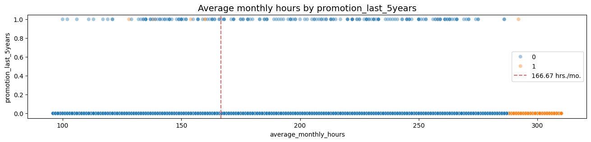

#### Observations:

- very few employees who were promoted in the last five years left
- very few employees who worked the most hours were promoted
- all of the employees who left were working the longest hours

---

10. Inspected how the employees who left are distributed across departments. There doesn't seem to be any department that differs significantly in its proportion of employees who left to those who stayed.

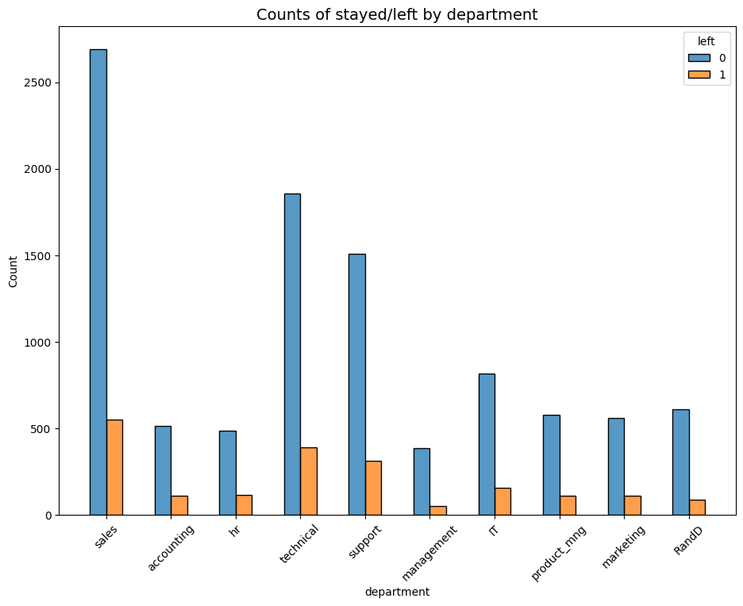

---

11. Check for strong correlations between variables in the data. The correlation heatmap confirms that the number of projects, monthly hours, and evaluation scores all have some positive correlation with each other, and whether an employee leaves is negatively correlated with their satisfaction level.

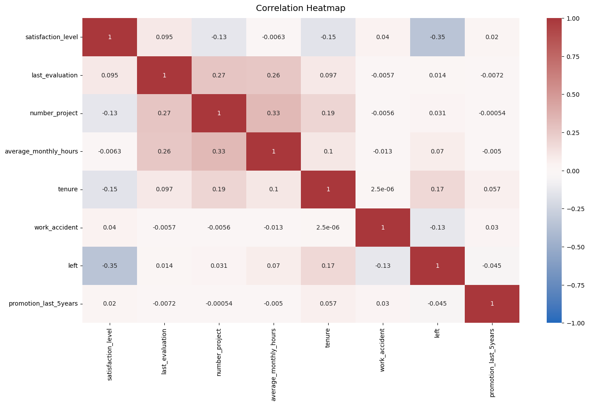

---

### Insights

- It appears that employees are leaving the company as a result of poor management. 
- Leaving is tied to longer working hours, many projects, and generally lower satisfaction levels.
- It can be ungratifying to work long hours and not receive promotions or good evaluation scores.
- There's a sizeable group of employees at this company who are probably burned out.
- It also appears that if an employee has spent more than six years at the company, they tend not to leave.

---

## Modeling Building

### Identify the type of prediction task

Our goal is to predict whether an employee leaves the company, which is a categorical outcome variable. So this task involves classification. 

More specifically, this involves binary classification, since the outcome variable `left` can be either 1 (indicating employee left) or 0 (indicating employee didn't leave).

### Identify the types of models most appropriate for this task

Since the variable we want to predict (whether an employee leaves the company) is categorical, we could either build a Logistic Regression model, or a Tree-based Machine Learning model.

### Modeling Approach A: Logistic Regression

Before splitting the data, encode the non-numeric variables. There are two: `department` and `salary`. 

`department` is a categorical variable, which means we can dummy it for modeling. 

`salary` is categorical too, but it's ordinal. There's a hierarchy to the categories, so it's better not to dummy this column, but rather to convert the levels to numbers, 0-2.

Since logistic regression is quite sensitive to outliers, we removed the outliers in the `tenure` column that were identified earlier.

Created a confusion matrix to visualize the results of the logistic regression model.

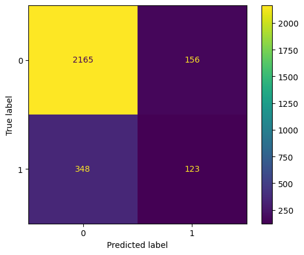

- The upper-left quadrant displays the number of true negatives.
- The upper-right quadrant displays the number of false positives.
- The bottom-left quadrant displays the number of false negatives.
- The bottom-right quadrant displays the number of true positives.

True negatives: The number of people who did not leave that the model accurately predicted did not leave.

False positives: The number of people who did not leave the model inaccurately predicted as leaving.

False negatives: The number of people who left that the model inaccurately predicted did not leave

True positives: The number of people who left the model accurately predicted as leaving

A perfect model would yield all true negatives and true positives, and no false negatives or false positives.

Created a classification report which shows that the logistic regression model achieved a precision of 79%, recall of 82%, f1-score of 80% (all weighted averages), and accuracy of 82%. 

However, if it's most important to predict employees who leave, then the scores are significantly lower.

### Modeling Approach B: Tree-based Model

Constructed a decision tree model and set up cross-validated grid-search to exhuastively search for the best model parameters.

Constructed a random forest model and set up cross-validated grid-search to exhuastively search for the best model parameters.

The evaluation scores of the random forest model are better than those of the decision tree model, with the exception of recall (the recall score of the random forest model is approximately 0.001 lower, which is a negligible amount). This indicates that the random forest model mostly outperforms the decision tree model.

### Feature Engineering

There is a chance that there is some data leakage occurring. Data leakage is when you use data to train your model that should not be used during training, either because it appears in the test data or because it's not data that you'd expect to have when the model is actually deployed. Training a model with leaked data can give an unrealistic score that is not replicated in production.

In this case, it's likely that the company won't have satisfaction levels reported for all of its employees. 

It's also possible that the `average_monthly_hours` column is a source of some data leakage. If employees have already decided upon quitting, or have already been identified by management as people to be fired, they may be working fewer hours. 

The first round of decision tree and random forest models included all variables as features. This next round will incorporate feature engineering to build improved models. 

We could proceed by dropping `satisfaction_level` and creating a new feature that roughly captures whether an employee is overworked. We could call this new feature `overworked`. It will be a binary variable.

Constructed the round 2 of decision tree and random forest models after performing feature engineering.

Plotted a confusion matrix to visualize how well it predicts on the test set.

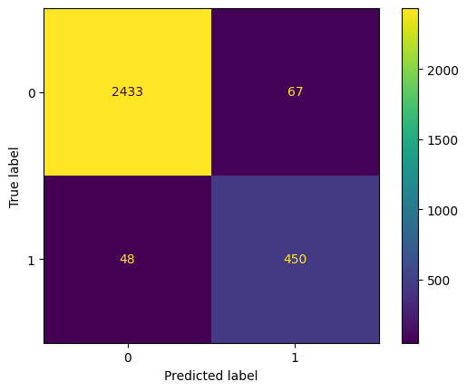

The model predicts more false positives than false negatives, which means that some employees may be identified as at risk of quitting or getting fired, when that's actually not the case. But this is still a strong model.

### Decision tree feature importance

Created a barplot to visualize the decision tree feature importances.

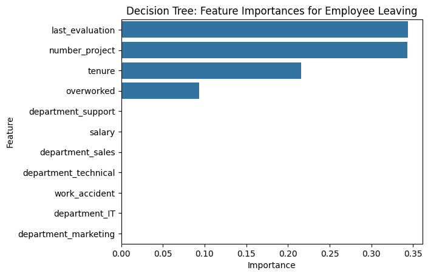

The barplot above shows that in this decision tree model, `last_evaluation`, `number_project`, `tenure`, and `overworked` have the highest importance, in that order. These variables are most helpful in predicting the outcome variable, `left`.

### Random forest feature importance

Created a barplot to visualize the random forest feature importances.

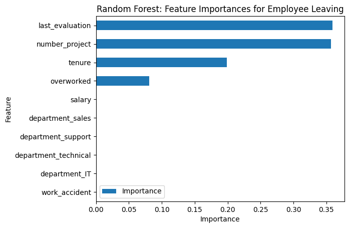

The plot above shows that in this random forest model, `last_evaluation`, `number_project`, `tenure`, and `overworked` have the highest importance, in that order. These variables are most helpful in predicting the outcome variable, `left`, and they are the same as the ones used by the decision tree model.

---

## Results and Evaluation

### Summary of model results

**Logistic Regression**

The logistic regression model achieved precision of 79%, recall of 82%, f1-score of 80% (all weighted averages), and accuracy of 82%, on the test set.

**Tree-based Machine Learning**

After conducting feature engineering, the random forest model achieved AUC of 93.8%, precision of 87%, recall of 90.4%, f1-score of 88.7%, and accuracy of 96.2%, on the test set. The random forest modestly outperformed the decision tree model.

---

### Conclusion & Recommendations

The models and the feature importances extracted from the models confirm that employees at the company are overworked. 

To retain employees, the following recommendations could be presented to the stakeholders:

* Cap the number of projects that employees can work on.
* Consider promoting employees who have been with the company for atleast four years, or conduct further investigation about why four-year tenured employees are so dissatisfied. 
* Either reward employees for working longer hours, or don't require them to do so. 
* If employees aren't familiar with the company's overtime pay policies, inform them about this. If the expectations around workload and time off aren't explicit, make them clear. 
* Hold company-wide and within-team discussions to understand and address the company work culture, across the board and in specific contexts. 
* High evaluation scores should not be reserved for employees who work 200+ hours per month. Consider a proportionate scale for rewarding employees who contribute more/put in more effort. 

**Next Steps**

It may be justified to still have some concern about data leakage. 

It could be prudent to consider how predictions change when `last_evaluation` is removed from the data. 

It's possible that evaluations aren't performed very frequently, in which case it would be useful to be able to predict employee retention without this feature. 

It's also possible that the evaluation score determines whether an employee leaves or stays, in which case it could be useful to pivot and try to predict performance score.

